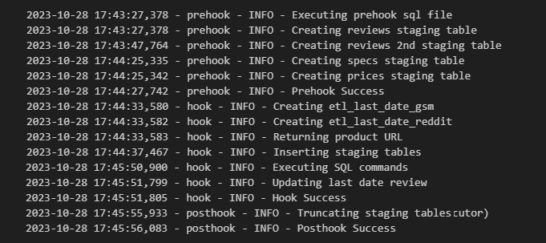
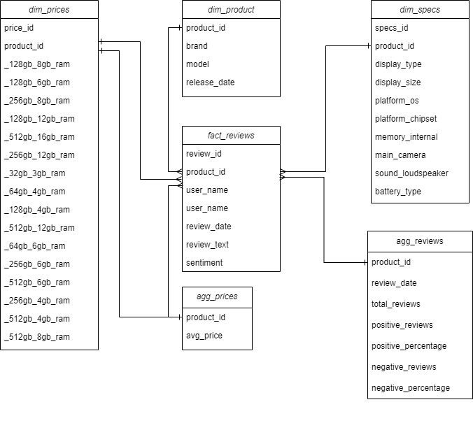
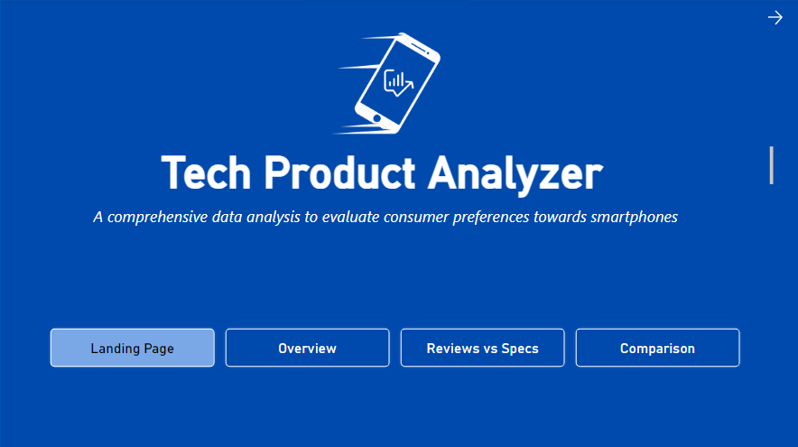
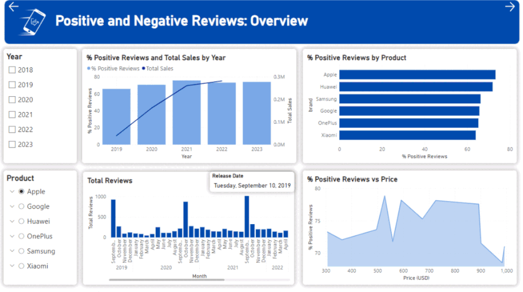
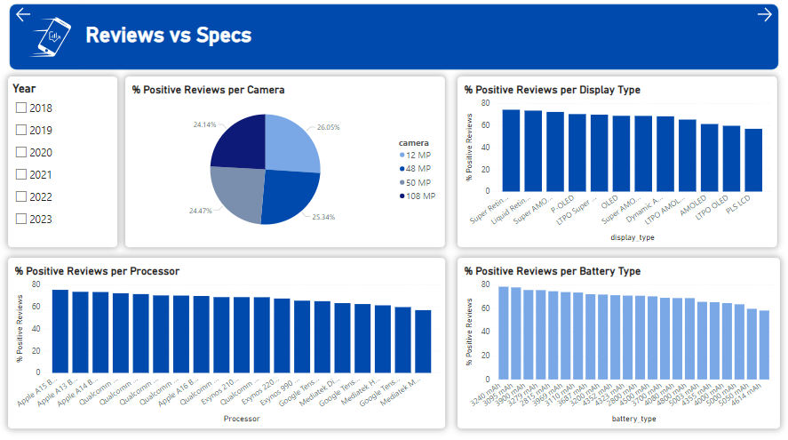
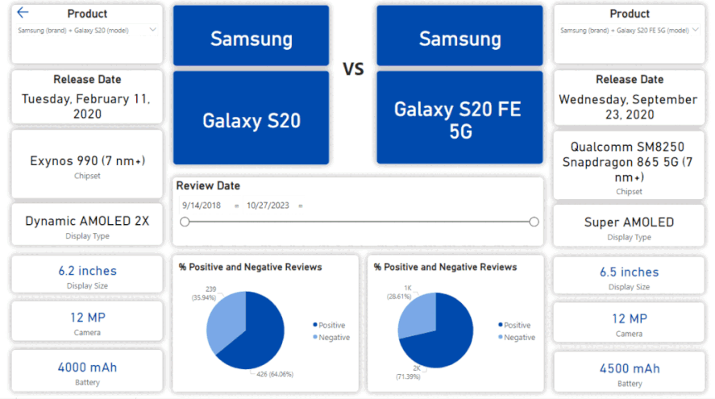

<div>

> Hello world! This is the project’s summary that describes the project, plain and simple, limited to the space available.
**[PROJECT PHILOSOPHY](#project-philosophy) • [PROTOTYPING](#prototyping) • [TECH STACKS](#stacks) • [IMPLEMENTATION](#demo) • [HOW TO RUN?](#run)**

</div> 
  

<br><br>

<!-- project philosophy -->

<a  name="philosophy" ></a>


> Tech Product Analyzer is a Python-based ETL (Extract, Transform, Load) project designed to gather and analyze data from various web sources. The primary focus of this project is to provide comprehensive insights into tech products, with a particular emphasis on smartphones. This is achieved by extracting user reviews and preferences, transforming the data, and loading it into a PostgreSQL database for in-depth analysis. 

<br>

  

### User Types

 

1. Data Engineers.
2. Data Analysts.
3. Tech Influencers .
4. Smartphones shop owners.

  

<br>

  

### User Stories

  
1. As a Data Engineer:<br>
	- I want to automatically scrape various and new released products from reputable sources with the latest - reviews so that our dataset is always up-to-date. <br>
	- I want to integrate different data sources seamlessly.<br>
	- I want to ensure there is fault tolerance in our data pipelines, so that potential failures don't interrupt our analyses.
2. As an Analyst: <br>
	- I want to query the database.<br>
	- I want to view the sentiment analysis results to understand users sentiment about different brands and products.<br>
	- I want to visualize the data using PowerBI.
3. As a Tech Influencer:<br>
	- I want to access detailed and up-to-date information about the latest tech products, with a particular focus on smartphones.<br>
	- I want to be able to track trends and user sentiments, enabling me to create relevant and engaging content for my audience.<br>
4. As a Smartphone Shop Owner:<br>
	- I want insights into customer preferences and trending smartphone models to inform my inventory management and marketing strategies.<br>
	- I want to track product performance and customer reviews to ensure that the products I offer align with market demands.


<br><br>

<!-- Prototyping -->


> We have designed our projects to webscrape, through an ETL project and including it in a PowerBI Sample Dashboard, 

  

### Logger File

  


| app.log |
| -----------------|
| |

  
  

### Data Flow Diagrams

  


| Data Flow Diagram |
| -----------------|
| |


<br>
<br>

  

<!-- Tech stacks -->

<a  name="stacks"></a>


<br>


  


  

## Frontend

Interactive PowerBI Dashboard:<br>
A central dashboard where viewers can check:

1. Market Indicator: Graphs, charts and visualizations displaying yearly sales of manufacturers.
2. Sentiment Analysis: Representations of consumers sentiment about different products over time through pie charts and bars.
3. Specs Analysis: Display correlation between the specs and the reviews.
4. Interactive Filters: options to filter data by date, brand, or product for customized views.


  

<br>

  

## Backend

1. Web scraping & Automation.
2. ETL Pipeline: using Python and pandas, raw data is extracted, transformed into a usable format and loaded into PostgreSQL database.
3. Database: Schema Design - Indexing - Data Integrity.

<br>

<br>

  

<!-- Implementation -->

<a  name="Demo"  ></a>


<br>

  


  
### PowerBi Dashboard

  
| Landing Page |
| -----------------|
| |

| Overview |
| -----------------|
| |

| Reviews vs Specs |
| -----------------|
| |

| Comparison |
| -----------------|
| |

| Demo|
| -----------------|

  

https://github.com/Georgess2293/tech_product_analyzer/assets/128224331/14a896cc-3e68-4853-b9cb-b79b99d49918


  

<br><br>
  


<!-- How to run -->

<a  name="run"  ></a>

  

> To set up ## **Tech Product Analyzer** follow these steps:

### Prerequisites


**Hardware & Software**:

-   A computer/server with sufficient RAM and processing power.
-   Operating System: Linux (preferred for production) or Windows.
-   Required Software: Python (3.x), PostgreSQL, Git (for version control), and any other specific software packages.
  
  

**Dependencies**:

-   Install the necessary Python libraries by referring to the requirements.txt file:

```sh

pip install -r requirements.txt

```

-   Install database connectors/drivers for PostgreSQL.

- Create a free reddit app and pass it as an input to the etl as follows:

```sh

reddit=praw.Reddit(
            client_id="Your_client_id",
            client_secret="Your_client_secret",
            user_agent="Your_user_agent"
        )

```
  

### **Setting Up the Environment**:

**Clone the Repository**:


```sh

git clone https://github.com/Georgess2293/fsd_tech_product_analyzer.git

```

  
**Set Up the Database**:

-   Start the PostgreSQL server.
-   Create a new database and user with the appropriate permissions.
-   Run any initialization scripts to set up tables or initial.

### **Running the Backend**:

**Start the Data Ingestion & ETL Process**:
`python main.py`


As for the dashboard access: Please use this link ["public powerbi link"](https://app.powerbi.com/view?r=eyJrIjoiZWU0OGU4MTgtMzlmMi00NzA5LWI4YWYtN2QzNWQ4ZjBjNDcxIiwidCI6IjJhZDk2OTM0LTQzZTUtNDFjMi05NzYxLWYzMzVmZTIxNGNjMyIsImMiOjl9) to access your data

